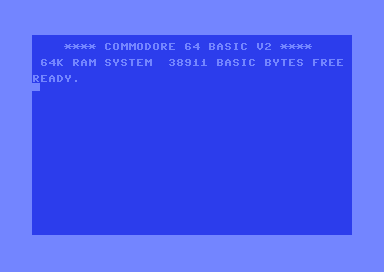
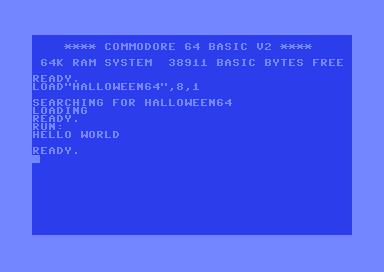
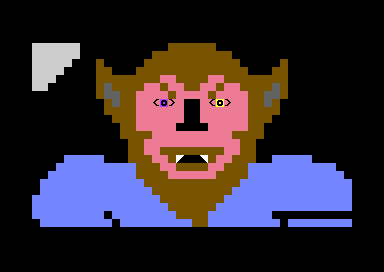
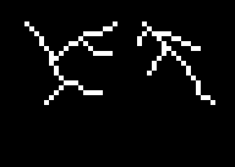

# halloween64
Simple halloween-themed programs for the Commodore 64.

When I was young my family owned a Commodore 64 and we subscribed to[ _Family Computing Magazine_](https://en.wikipedia.org/wiki/Family_Computing). Each month, when the issue arrived, we'd spend a good deal of time typing the programs from the current issue into our computer. One Halloween I looped two of the programs together and played them in our front window. And here they are.

[See the video on YouTube](https://youtu.be/ZWivZAs-w-M?si=hwWGSXmrCXGKsekn)

## Setup
The following steps are for setting up on a Mac. More complete instructions can be found by opening the command palette in VSCode and run the `VS64: Getting Started` command after installing the [vs64](https://github.com/rolandshacks/vs64) extension.

_Note: There are minor issues if you have more than one instance of VS Code open. The `build` directory and `.vscode` directory will get created in the top codebase in the workspace in each open instance._

1. Get the [vs64](https://github.com/rolandshacks/vs64) extension for VSCode.
1. Install [ACME Cross-Assembler](https://sourceforge.net/projects/acme-crossass/) `brew install acme`
1. Install the [VICE emulator](https://vice-emu.sourceforge.io/) `brew install vice`
1. Type `x64sc` in the command line to run the emulator.
1. Open the Command Palette with `Command + Shift + P` and select one of the commands. `VS64 Build` should run this project.

Change the `main` filename in the `project-config.json` to change which program runs.

## main.bas

A simple "Hello World" script so that I could test the _vs64_ extension and _VICE_ emulator installation.

## werewolf.bas

An animated werewolf from Issue 38 of _Family Computing Magazine_ (October 1986) "Werewolf" by Joey Latimer. I added the quote from _The Wolfman_ at the beginning.

## lightning.bas

Lightning animation and sound from Issue 38 of _Family Computing Magazine_ (October 1986) "Frightening Lightning" by Joey Latimer.

## Resources
- [VICE Emulator User Manual](https://vice-emu.sourceforge.io/vice_toc.html)
- [_Family Computing Magazine_ (October 1986)](https://archive.org/details/family-computing-38) via The Internet Archives.
- Thanks to [Joey Latimer](https://joeylatimer.com/), original author of "Werewolf" and "Frightening Lightning" and many other programs from _Family Computing Magazine_. Check out his music.
